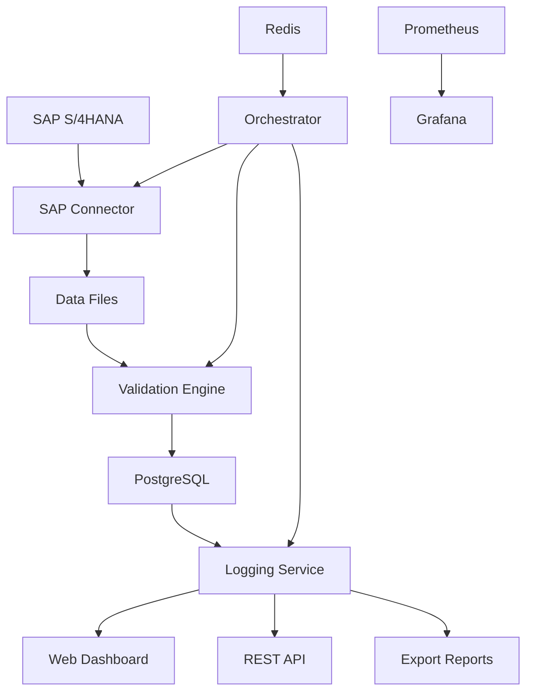

# SAP S/4HANA PM Data Quality Workflow Architecture

## Overview

This document describes the modular, containerized data quality workflow for SAP S/4HANA Plant Maintenance (PM) module. The system automatically assesses, reports, and improves data quality across PM datasets.

## Architecture Components

### 1. SAP Connector Container (`sap-connector/`)
**Purpose**: Extracts data from SAP S/4HANA via OData and RFC connections

**Key Features**:
- OAuth 2.0 authentication with SAP S/4HANA
- Data extraction for all PM entities (equipment, functional locations, maintenance orders, notifications, maintenance plans)
- Rate limiting and error handling
- Prometheus metrics collection
- Structured logging with JSON format

**Data Extraction Endpoints**:
- `/extract/equipment` - Equipment master data
- `/extract/functional-locations` - Functional location data
- `/extract/maintenance-orders` - Maintenance order data
- `/extract/notifications` - Notification data
- `/extract/maintenance-plans` - Maintenance plan data
- `/extract/all` - Bulk extraction of all data types

**Security**:
- Certificate-based authentication support
- Encrypted data transmission
- Secure credential management

### 2. Validation Engine Container (`validation-engine/`)
**Purpose**: Runs data quality rules and assessments using Great Expectations and custom business rules

**Key Features**:
- Configurable validation rules (YAML format)
- Great Expectations integration for statistical validation
- Custom business rules for PM-specific validations
- Cross-reference consistency checks
- Database storage of validation results

**Validation Categories**:
- **Completeness**: Missing required fields, incomplete records
- **Accuracy**: Invalid values, incorrect relationships
- **Consistency**: Cross-table mismatches, data integrity issues
- **Timeliness**: Overdue maintenance orders, outdated records

**Validation Endpoints**:
- `/validate/equipment` - Equipment data validation
- `/validate/maintenance-orders` - Maintenance order validation
- `/validate/cross-reference` - Cross-reference consistency validation

### 3. Logging & Reporting Service (`logging-service/`)
**Purpose**: Provides web dashboard, REST API, and reporting functionality

**Key Features**:
- Modern web dashboard with real-time metrics
- REST API for programmatic access
- Export functionality (CSV, Excel, PDF)
- Data visualization with Chart.js and Plotly
- Quality trend analysis

**Dashboard Features**:
- Overview metrics (total validations, success rate, issues count)
- Interactive charts (validation status distribution, quality trends)
- Dataset quality summary table
- Recent issues with detailed view
- Export capabilities

**API Endpoints**:
- `/api/validation-summary` - Get validation summary
- `/api/recent-issues` - Get recent validation issues
- `/api/quality-report` - Generate comprehensive quality report
- `/api/export/{format}` - Export data in various formats

### 4. Orchestrator Container (`orchestrator/`)
**Purpose**: Apache Airflow for workflow orchestration and scheduling

**Key Features**:
- Configurable schedules for data extraction and validation
- Error handling and retry logic
- Monitoring and alerting
- DAG-based workflow management

**Workflow Components**:
- Data extraction scheduling
- Validation rule execution
- Report generation
- Alert notifications

### 5. Supporting Services

**PostgreSQL Database**:
- Stores validation results, metrics, and configuration
- Optimized schema with indexes for performance
- Audit logging and data retention policies

**Redis**:
- Caching layer for Airflow
- Session management
- Temporary data storage

**Prometheus**:
- Metrics collection from all services
- Custom recording rules for data quality metrics
- Alerting rules for system health

**Grafana**:
- Real-time monitoring dashboards
- Custom data quality visualizations
- System resource monitoring

## Data Flow



## Data Quality Rules

### Equipment Completeness Rules
- Required fields validation (Equipment, EquipmentName, EquipmentCategory)
- Empty equipment names check
- Equipment category validation (M, F, K, P)
- Manufacturer serial number format validation
- Functional location reference format validation

### Maintenance Orders Timeliness Rules
- Overdue maintenance orders detection
- Incomplete orders (missing functional location or equipment)
- Order status consistency validation
- Work center assignment validation
- Order aging analysis

### Cross-Reference Consistency Rules
- Equipment-functional location consistency
- Maintenance order equipment references
- Maintenance order functional location references
- Notification references validation
- Hierarchical consistency validation

## Security Features

### Authentication & Authorization
- OAuth 2.0 authentication with SAP S/4HANA
- Certificate-based authentication support
- Role-based access control
- API key management

### Data Protection
- Encrypted data transmission (TLS/SSL)
- Secure credential storage
- Audit logging for all operations
- Data retention policies

### Network Security
- Container network isolation
- Internal service communication
- External access control
- Firewall rules

## Monitoring & Alerting

### Metrics Collection
- Service health status
- Validation success/failure rates
- Data extraction performance
- API response times
- System resource usage

### Alerting Rules
- High validation error rate (>10%)
- Low success rate (<90%)
- High validation latency (>30s)
- Service down alerts
- Resource usage alerts

### Dashboard Panels
- Overall data quality score
- Validation error rate
- Validation latency (95th percentile)
- Rule execution rate
- Data extraction rate
- Service health status
- System resources

## Deployment Architecture

### Container Orchestration
```yaml
Services:
  - sap-connector (Port 8000)
  - validation-engine (Port 8001)
  - logging-service (Port 8080)
  - orchestrator (Port 8081)
  - postgres (Port 5432)
  - redis (Port 6379)
  - prometheus (Port 9090)
  - grafana (Port 3000)
```

### Network Configuration
- Internal network: `sap-network` (172.20.0.0/16)
- Service-to-service communication
- External access through reverse proxy
- Health checks for all services

### Volume Management
- Persistent data storage
- Log file management
- Configuration file mounting
- Certificate storage

## Configuration Management

### Environment Variables
- SAP connection parameters
- Database configuration
- Security keys
- Monitoring settings
- Alerting configuration

### Data Quality Rules
- YAML-based rule configuration
- Business rule definitions
- Threshold settings
- Notification rules

### Monitoring Configuration
- Prometheus targets
- Grafana dashboards
- Alerting rules
- Recording rules

## Performance Optimization

### Database Optimization
- Indexed queries for fast retrieval
- Partitioned tables for large datasets
- Connection pooling
- Query optimization

### Caching Strategy
- Redis caching for frequently accessed data
- In-memory caching for validation results
- Static asset caching
- Session management

### Resource Management
- Container resource limits
- Memory and CPU allocation
- Storage optimization
- Network bandwidth management

## Disaster Recovery

### Backup Strategy
- Database backup automation
- Configuration backup
- Log file retention
- Certificate backup

### Recovery Procedures
- Service restart procedures
- Data restoration processes
- Configuration recovery
- Monitoring restoration

## Scalability Considerations

### Horizontal Scaling
- Stateless service design
- Load balancer configuration
- Database read replicas
- Cache clustering

### Vertical Scaling
- Resource allocation optimization
- Performance tuning
- Memory management
- CPU utilization

## Integration Points

### SAP S/4HANA Integration
- OData service consumption
- RFC function calls
- Authentication mechanisms
- Error handling

### External Systems
- Email notification system
- Slack integration
- External monitoring tools
- Reporting systems

## Maintenance Procedures

### Regular Maintenance
- Database cleanup
- Log file rotation
- Certificate renewal
- Configuration updates

### Troubleshooting
- Service health checks
- Log analysis procedures
- Performance monitoring
- Error resolution

## Future Enhancements

### Planned Features
- Machine learning-based data quality assessment
- Automated data correction
- Advanced reporting capabilities
- Mobile dashboard access

### Technology Upgrades
- Latest framework versions
- Security updates
- Performance improvements
- New monitoring features 