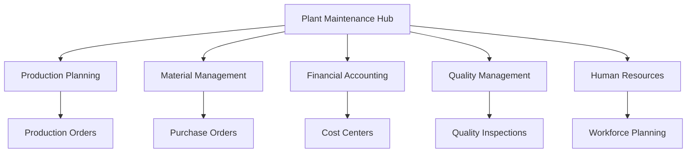

# SAP Plant Maintenance Module Integration: A Comprehensive Guide

## Executive Summary

The SAP Plant Maintenance (PM) module integration represents a critical component of enterprise asset management (EAM) within SAP S/4HANA. This integration enables organizations to optimize maintenance operations, reduce downtime, and improve asset lifecycle management through seamless data flow and automated processes.

## Table of Contents

1. [Overview of Plant Maintenance Module](#overview)
2. [Integration Architecture](#architecture)
3. [Key Integration Points](#integration-points)
4. [Business Benefits](#benefits)
5. [Technical Implementation](#implementation)
6. [Data Quality Considerations](#data-quality)
7. [Risk Assessment](#risk-assessment)
8. [Governance Framework](#governance)
9. [Implementation Roadmap](#roadmap)
10. [Success Metrics](#metrics)

## Overview of Plant Maintenance Module {#overview}

### Core Functionality

The SAP Plant Maintenance module provides comprehensive functionality for managing physical assets throughout their lifecycle:

- **Preventive Maintenance**: Scheduled maintenance planning and execution
- **Corrective Maintenance**: Reactive maintenance for unexpected failures
- **Predictive Maintenance**: AI-driven maintenance based on condition monitoring
- **Asset Management**: Complete asset lifecycle from acquisition to disposal
- **Work Order Management**: End-to-end work order processing
- **Spare Parts Management**: Inventory optimization for maintenance activities

### Integration Scope

The PM module integrates with multiple SAP modules to create a unified maintenance ecosystem:

```
┌─────────────────┐    ┌─────────────────┐    ┌─────────────────┐
│   Production    │    │   Procurement   │    │   Finance       │
│   (PP)          │◄──►│   (MM)          │◄──►│   (FI/CO)       │
└─────────────────┘    └─────────────────┘    └─────────────────┘
         │                       │                       │
         └───────────────────────┼───────────────────────┘
                                 │
                    ┌─────────────────┐
                    │   Plant         │
                    │   Maintenance   │
                    │   (PM)          │
                    └─────────────────┘
                                 │
                    ┌─────────────────┐
                    │   Quality       │
                    │   Management    │
                    │   (QM)          │
                    └─────────────────┘
```

## Integration Architecture {#architecture}

### Data Flow Architecture

The PM module integration follows a hub-and-spoke architecture pattern:

#### Central PM Hub
- **Asset Master Data**: Central repository for all equipment and functional locations
- **Maintenance Orders**: Core work order management system
- **Measurement Points**: Condition monitoring data collection
- **Maintenance Plans**: Preventive maintenance scheduling engine

#### Integration Spokes
- **Production Integration**: Links maintenance to production planning
- **Procurement Integration**: Connects maintenance needs to material procurement
- **Financial Integration**: Tracks maintenance costs and budget allocation
- **Quality Integration**: Ensures maintenance meets quality standards

### Technical Architecture



## Key Integration Points {#integration-points}

### 1. Production Planning (PP) Integration

**Purpose**: Align maintenance activities with production schedules

**Key Features**:
- Maintenance windows integrated into production planning
- Equipment availability status shared with production
- Maintenance impact on production capacity calculation
- Work order prioritization based on production needs

**Data Exchange**:
- Equipment status updates
- Maintenance schedules
- Production capacity adjustments
- Work order completion notifications

### 2. Material Management (MM) Integration

**Purpose**: Optimize spare parts inventory and procurement

**Key Features**:
- Automatic spare parts requisition from work orders
- Inventory level monitoring for critical spare parts
- Vendor performance tracking for maintenance supplies
- Cost analysis of maintenance materials

**Data Exchange**:
- Material requirements from maintenance orders
- Inventory levels and availability
- Purchase order status
- Material cost allocation

### 3. Financial Integration (FI/CO)

**Purpose**: Track and control maintenance costs

**Key Features**:
- Real-time cost tracking for maintenance activities
- Budget allocation and monitoring
- Cost center analysis for maintenance operations
- Asset depreciation impact from maintenance

**Data Exchange**:
- Maintenance cost postings
- Budget vs. actual comparisons
- Asset value updates
- Cost center allocations

### 4. Quality Management (QM) Integration

**Purpose**: Ensure maintenance meets quality standards

**Key Features**:
- Quality inspections integrated into maintenance processes
- Maintenance quality metrics and reporting
- Compliance tracking for regulated industries
- Quality-based maintenance scheduling

**Data Exchange**:
- Quality inspection results
- Non-conformance reports
- Quality metrics and KPIs
- Compliance documentation

## Business Benefits {#benefits}

### Operational Benefits

#### 1. Reduced Downtime
- **Predictive Maintenance**: AI-driven maintenance scheduling reduces unexpected failures
- **Optimized Scheduling**: Integration with production planning minimizes maintenance impact
- **Faster Response**: Automated work order creation and material requisition

#### 2. Cost Optimization
- **Inventory Reduction**: Just-in-time spare parts management
- **Labor Efficiency**: Optimized workforce planning and skill matching
- **Energy Savings**: Condition-based maintenance reduces energy waste

#### 3. Compliance and Safety
- **Regulatory Compliance**: Automated compliance tracking and reporting
- **Safety Standards**: Integrated safety checks and procedures
- **Audit Trail**: Complete documentation of maintenance activities

### Strategic Benefits

#### 1. Asset Lifecycle Optimization
- **Extended Asset Life**: Proper maintenance extends equipment lifespan
- **Performance Monitoring**: Real-time asset performance tracking
- **Investment Planning**: Data-driven capital investment decisions

#### 2. Data-Driven Decision Making
- **Predictive Analytics**: AI-powered failure prediction
- **Performance Metrics**: Comprehensive KPI dashboard
- **Trend Analysis**: Historical data analysis for continuous improvement

## Technical Implementation {#implementation}

### System Requirements

#### Hardware Requirements
- **Application Server**: Minimum 16GB RAM, 8 CPU cores
- **Database Server**: Minimum 32GB RAM, 16 CPU cores
- **Storage**: High-performance SSD with redundancy
- **Network**: High-bandwidth, low-latency connectivity

#### Software Requirements
- **SAP S/4HANA**: Latest version with PM module activated
- **Database**: SAP HANA with appropriate licensing
- **Integration Tools**: SAP Process Integration (PI) or SAP Cloud Platform Integration
- **Analytics**: SAP Analytics Cloud or SAP BW/4HANA

### Implementation Phases

#### Phase 1: Foundation (Months 1-3)
- **System Setup**: Install and configure SAP S/4HANA with PM module
- **Master Data**: Set up equipment master data and functional locations
- **Basic Integration**: Establish core integration points with MM and FI
- **User Training**: Basic PM module training for key users

#### Phase 2: Core Functionality (Months 4-6)
- **Work Order Management**: Implement complete work order lifecycle
- **Preventive Maintenance**: Set up maintenance plans and schedules
- **Material Integration**: Connect with MM for spare parts management
- **Financial Integration**: Implement cost tracking and budget management

#### Phase 3: Advanced Features (Months 7-9)
- **Predictive Maintenance**: Implement condition monitoring and AI-driven maintenance
- **Mobile Solutions**: Deploy mobile maintenance applications
- **Analytics**: Implement advanced reporting and analytics
- **Quality Integration**: Connect with QM for quality assurance

#### Phase 4: Optimization (Months 10-12)
- **Performance Tuning**: Optimize system performance and user experience
- **Process Optimization**: Refine maintenance processes based on usage data
- **Advanced Analytics**: Implement predictive analytics and machine learning
- **Continuous Improvement**: Establish feedback loops for ongoing optimization

### Data Migration Strategy

#### Master Data Migration
- **Equipment Data**: Migrate existing equipment master data
- **Functional Locations**: Set up hierarchical location structure
- **Maintenance Plans**: Convert existing maintenance schedules
- **User Data**: Migrate user profiles and authorizations

#### Transactional Data Migration
- **Work Orders**: Migrate open and recent work orders
- **Maintenance History**: Import historical maintenance records
- **Cost Data**: Migrate historical cost information
- **Inventory Data**: Import spare parts inventory levels

## Data Quality Considerations {#data-quality}

### Critical Data Elements

#### Equipment Master Data
- **Equipment ID**: Unique identifier for each asset
- **Equipment Type**: Classification for maintenance planning
- **Location**: Physical location for work order assignment
- **Manufacturer**: Original equipment manufacturer information
- **Installation Date**: For lifecycle calculations
- **Warranty Information**: For cost optimization

#### Maintenance Data
- **Work Order Status**: Real-time status tracking
- **Maintenance Type**: Preventive, corrective, or predictive
- **Priority Level**: For scheduling optimization
- **Estimated Duration**: For resource planning
- **Required Skills**: For workforce allocation
- **Required Materials**: For inventory planning

### Data Quality Metrics

#### Completeness
- **Equipment Data**: 95% completeness target
- **Maintenance History**: 100% completeness for active equipment
- **Cost Data**: 90% completeness for financial reporting

#### Accuracy
- **Equipment Status**: Real-time accuracy requirements
- **Maintenance Schedules**: 98% schedule adherence
- **Cost Allocation**: 95% accuracy for cost tracking

#### Consistency
- **Data Standards**: Consistent naming conventions
- **Process Standards**: Standardized maintenance procedures
- **Integration Standards**: Consistent data exchange formats

### Data Governance Framework

#### Data Ownership
- **Equipment Data**: Owned by Engineering/Operations
- **Maintenance Data**: Owned by Maintenance Department
- **Cost Data**: Owned by Finance Department
- **Quality Data**: Owned by Quality Assurance

#### Data Stewardship
- **Data Stewards**: Assigned for each data domain
- **Change Management**: Formal process for data changes
- **Audit Trail**: Complete tracking of data modifications
- **Data Validation**: Automated and manual validation processes

## Risk Assessment {#risk-assessment}

### Technical Risks

#### High-Risk Areas
1. **Data Migration Complexity**
   - **Risk**: Data quality issues during migration
   - **Mitigation**: Comprehensive data validation and testing
   - **Impact**: Project delays and user adoption issues

2. **Integration Complexity**
   - **Risk**: Integration failures between modules
   - **Mitigation**: Phased implementation with thorough testing
   - **Impact**: System downtime and process disruptions

3. **Performance Issues**
   - **Risk**: System performance degradation with large data volumes
   - **Mitigation**: Performance testing and optimization
   - **Impact**: User productivity and system reliability

#### Medium-Risk Areas
1. **User Adoption**
   - **Risk**: Resistance to new processes and systems
   - **Mitigation**: Comprehensive training and change management
   - **Impact**: Reduced system utilization and benefits

2. **Data Quality**
   - **Risk**: Poor data quality affecting system effectiveness
   - **Mitigation**: Data governance and quality monitoring
   - **Impact**: Inaccurate reporting and decision making

### Business Risks

#### Operational Risks
1. **Process Disruption**
   - **Risk**: Maintenance processes disrupted during implementation
   - **Mitigation**: Parallel system operation during transition
   - **Impact**: Reduced maintenance effectiveness

2. **Resource Constraints**
   - **Risk**: Insufficient resources for implementation
   - **Mitigation**: Proper resource planning and allocation
   - **Impact**: Project delays and cost overruns

#### Strategic Risks
1. **ROI Achievement**
   - **Risk**: Failure to achieve expected benefits
   - **Mitigation**: Clear success metrics and monitoring
   - **Impact**: Investment justification and stakeholder confidence

## Governance Framework {#governance}

### Organizational Structure

#### Steering Committee
- **Executive Sponsor**: Senior management oversight
- **Project Manager**: Day-to-day project management
- **Business Representatives**: Key stakeholders from affected departments
- **Technical Representatives**: IT and system administration

#### Working Groups
- **Data Governance Group**: Data quality and standards
- **Process Design Group**: Maintenance process optimization
- **Technical Implementation Group**: System configuration and development
- **Change Management Group**: Training and user adoption

### Governance Processes

#### Decision-Making Framework
- **Strategic Decisions**: Steering committee approval required
- **Tactical Decisions**: Project manager with stakeholder consultation
- **Operational Decisions**: Working group consensus
- **Technical Decisions**: Technical team with business validation

#### Change Management Process
- **Change Request**: Formal process for system modifications
- **Impact Assessment**: Evaluation of change impact
- **Approval Process**: Multi-level approval for significant changes
- **Implementation**: Controlled implementation with rollback capability

### Compliance and Standards

#### Regulatory Compliance
- **Industry Standards**: Compliance with industry-specific regulations
- **Safety Standards**: Adherence to safety requirements
- **Environmental Standards**: Environmental compliance tracking
- **Quality Standards**: Quality management system compliance

#### Internal Standards
- **Data Standards**: Consistent data definitions and formats
- **Process Standards**: Standardized maintenance procedures
- **Technical Standards**: System configuration and integration standards
- **Security Standards**: Data security and access control

## Implementation Roadmap {#roadmap}

### Year 1: Foundation and Core Implementation

#### Q1: Project Initiation
- **Project Setup**: Team formation and project planning
- **Requirements Analysis**: Detailed business requirements gathering
- **System Design**: Technical architecture and system design
- **Vendor Selection**: Selection of implementation partners

#### Q2: System Setup and Configuration
- **System Installation**: SAP S/4HANA installation and configuration
- **Module Activation**: PM module activation and basic configuration
- **Integration Setup**: Core integration points establishment
- **Master Data Setup**: Initial equipment and location data setup

#### Q3: Core Functionality Implementation
- **Work Order Management**: Complete work order lifecycle implementation
- **Preventive Maintenance**: Maintenance planning and scheduling
- **Basic Integration**: MM and FI integration implementation
- **User Training**: Initial user training and system familiarization

#### Q4: Testing and Go-Live Preparation
- **System Testing**: Comprehensive testing of all functionality
- **User Acceptance Testing**: Business user testing and validation
- **Data Migration**: Final data migration and validation
- **Go-Live Preparation**: Final preparations for system launch

### Year 2: Advanced Features and Optimization

#### Q1: Go-Live and Stabilization
- **System Go-Live**: Production system launch
- **Post-Go-Live Support**: Intensive support during initial period
- **Issue Resolution**: Resolution of post-go-live issues
- **Performance Optimization**: System performance tuning

#### Q2: Advanced Features Implementation
- **Predictive Maintenance**: AI-driven maintenance implementation
- **Mobile Solutions**: Mobile maintenance applications deployment
- **Advanced Analytics**: Advanced reporting and analytics implementation
- **Quality Integration**: QM integration and quality processes

#### Q3: Process Optimization
- **Process Analysis**: Analysis of actual usage patterns
- **Process Optimization**: Optimization based on usage data
- **User Feedback**: Collection and implementation of user feedback
- **Continuous Improvement**: Establishment of improvement processes

#### Q4: Expansion and Enhancement
- **Additional Sites**: Rollout to additional locations
- **Advanced Features**: Implementation of advanced PM features
- **Integration Enhancement**: Enhancement of integration capabilities
- **Strategic Planning**: Planning for future enhancements

### Year 3: Strategic Optimization and Innovation

#### Q1: Performance Optimization
- **System Performance**: Advanced performance optimization
- **Process Efficiency**: Efficiency improvements based on data analysis
- **Cost Optimization**: Further cost reduction initiatives
- **User Experience**: Enhanced user experience improvements

#### Q2: Innovation and Advanced Analytics
- **Machine Learning**: Advanced ML implementation for predictive maintenance
- **IoT Integration**: Internet of Things integration for condition monitoring
- **Advanced Analytics**: Advanced analytics and business intelligence
- **Innovation Projects**: Pilot projects for new technologies

#### Q3: Strategic Expansion
- **Geographic Expansion**: Expansion to additional geographic locations
- **Functional Expansion**: Additional PM functionality implementation
- **Integration Expansion**: Integration with additional systems
- **Strategic Partnerships**: Partnerships for advanced capabilities

#### Q4: Strategic Planning and Future Roadmap
- **Strategic Assessment**: Assessment of current state and future needs
- **Technology Planning**: Planning for future technology adoption
- **Capability Planning**: Planning for additional PM capabilities
- **Long-term Roadmap**: Development of long-term strategic roadmap

## Success Metrics {#metrics}

### Key Performance Indicators (KPIs)

#### Operational KPIs
1. **Equipment Availability**
   - **Target**: 95% equipment availability
   - **Measurement**: Percentage of time equipment is operational
   - **Impact**: Direct impact on production capacity

2. **Maintenance Efficiency**
   - **Target**: 20% reduction in maintenance time
   - **Measurement**: Average time to complete maintenance tasks
   - **Impact**: Reduced labor costs and improved productivity

3. **Cost Reduction**
   - **Target**: 15% reduction in maintenance costs
   - **Measurement**: Total maintenance cost per asset
   - **Impact**: Improved profitability and cost control

#### Quality KPIs
1. **Maintenance Quality**
   - **Target**: 98% first-time fix rate
   - **Measurement**: Percentage of maintenance tasks completed successfully on first attempt
   - **Impact**: Reduced rework and improved reliability

2. **Compliance Rate**
   - **Target**: 100% regulatory compliance
   - **Measurement**: Percentage of maintenance activities meeting regulatory requirements
   - **Impact**: Risk mitigation and regulatory compliance

#### Strategic KPIs
1. **Asset Lifecycle Extension**
   - **Target**: 10% extension in asset useful life
   - **Measurement**: Average asset lifespan before replacement
   - **Impact**: Reduced capital expenditure and improved ROI

2. **Predictive Maintenance Accuracy**
   - **Target**: 90% accuracy in failure prediction
   - **Measurement**: Percentage of predicted failures that actually occur
   - **Impact**: Reduced unplanned downtime and maintenance costs

### Return on Investment (ROI) Analysis

#### Cost Savings
- **Reduced Downtime**: $500,000 annual savings from reduced unplanned downtime
- **Labor Efficiency**: $300,000 annual savings from improved maintenance efficiency
- **Inventory Optimization**: $200,000 annual savings from optimized spare parts inventory
- **Energy Savings**: $100,000 annual savings from condition-based maintenance

#### Revenue Impact
- **Increased Production**: $1,000,000 annual revenue increase from improved equipment availability
- **Quality Improvements**: $300,000 annual revenue increase from reduced quality issues
- **Customer Satisfaction**: $200,000 annual revenue increase from improved reliability

#### Total Annual Benefits
- **Cost Savings**: $1,100,000
- **Revenue Increase**: $1,500,000
- **Total Annual Benefits**: $2,600,000

#### Investment Costs
- **Software Licenses**: $500,000
- **Implementation Services**: $1,000,000
- **Hardware and Infrastructure**: $300,000
- **Training and Change Management**: $200,000
- **Total Investment**: $2,000,000

#### ROI Calculation
- **Payback Period**: 9.2 months
- **3-Year ROI**: 290%
- **5-Year ROI**: 550%

## Conclusion

The SAP Plant Maintenance module integration represents a strategic investment in operational excellence and asset management. Through comprehensive integration with other SAP modules, organizations can achieve significant improvements in maintenance efficiency, cost reduction, and asset reliability.

The key success factors include:
- **Strong Project Management**: Proper planning and execution
- **User Adoption**: Comprehensive training and change management
- **Data Quality**: Robust data governance and quality management
- **Continuous Improvement**: Ongoing optimization and enhancement

With proper implementation and governance, the PM module integration can deliver substantial business value and competitive advantage in today's increasingly complex manufacturing environment.

---

*This document provides a comprehensive overview of SAP Plant Maintenance module integration. For specific implementation details and technical specifications, please consult with your SAP implementation partner and technical team.* 